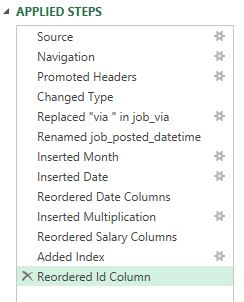
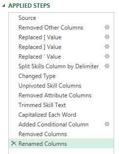
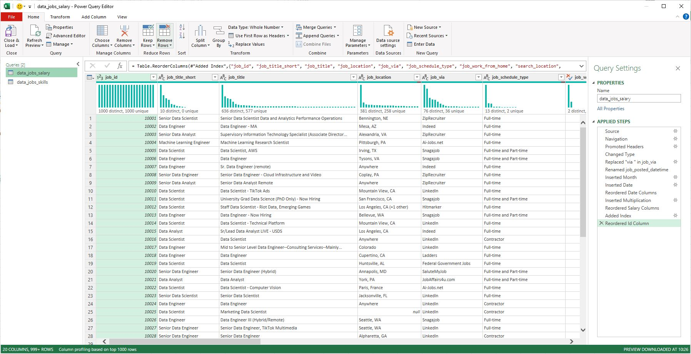
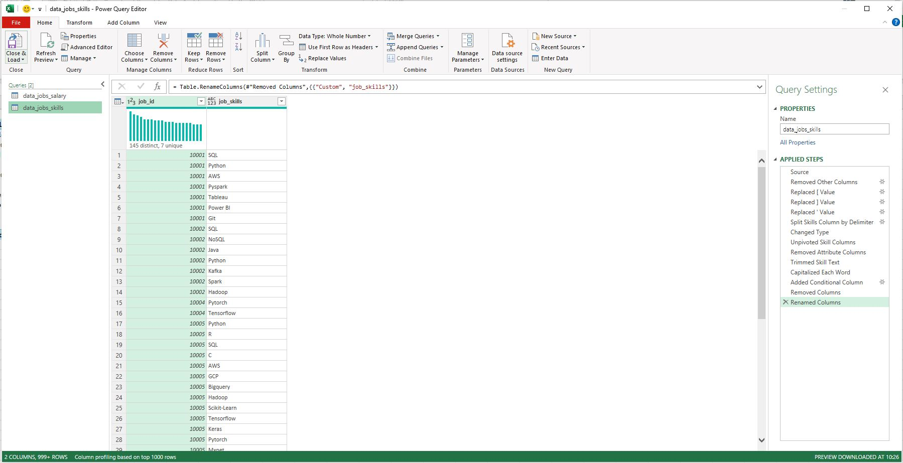
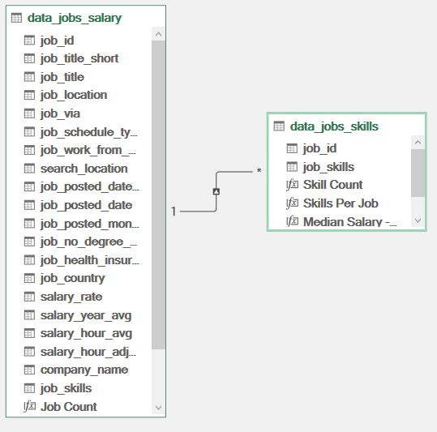
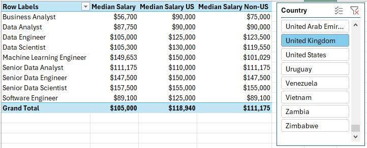
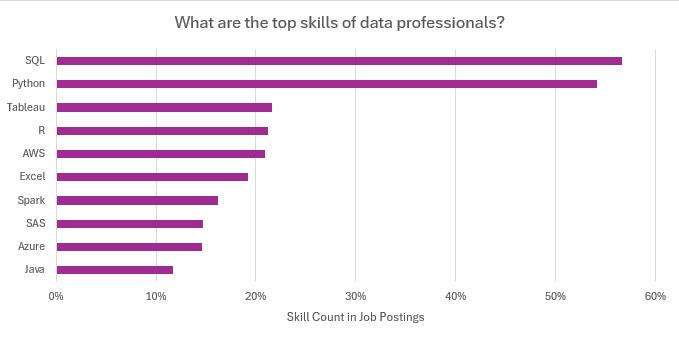
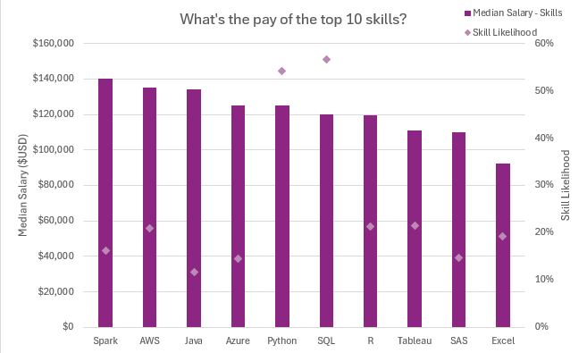

# Data Jobs Analysis Project (Excel)

This Excel project was created with the aim to analyse the data science job market and understand what employers are looking for while providing a great oppertunity to to practise advanced Excel skills.

Find the final spreadsheet here: [Excel_Project_for_Data_Analytics.xlsx](Excel_Project_for_Data_Analytics.xlsx)

## Objectives
The analysis focuses on four questions:
1. Do job postings that list more skills tend to offer higher salaries?
2. How do salaries differ by region?
3. What are the most common skills in data roles?
4. What are the top-paying skills?

## Excel Skills Practised
- Power Query (ETL)
- Power Pivot and Data Model  
- PivotTables  
- PivotCharts  
- Basic DAX measures

## Power Query (ETL)
Two queries were created and cleaned:
- **Jobs table**: job information  
- **Skills table**: individual skills linked by job ID  

Each query was transformed by changing column types, removing unnecessary columns, cleaning text to eliminate specific words, and trimming excess whitespace.

### data_jobs_all


### data_jobs_skills


Each query was then loaded into the workbook to be used for subsequent analysis.

### data_jobs_all


### data_jobs_skills


## Power Pivot & DAX
A relationship was created between the jobs and skills tables using the **job_id** field.



## Key Analysis

### 1. Skills vs Salary
Counted the number of skills per job and compared this with median salary using PivotTables.


Job postings that list more required skills generally offer higher median salaries, especially for roles like Senior Data Engineer and Data Scientist. Positions with fewer required skills, such as Business Analyst, tend to pay less. Overall, roles demanding more specialised skills are linked to higher salaries.

### 2. Salary by Region
I built a PivotTable using the Power Pivot data model, placing job_title_short in the rows and salary_year_avg in the values area. I then added a DAX measure to calculate the median salary specifically for United States roles (where most of this data is for).

I then created DAX measures to calculate median salary. Example:

``` excel
Median Salary := MEDIAN(data_jobs_all[salary_year_avg])
```



Senior Data Engineers and Data Scientists have higher median salaries both in the US and internationally, reflecting strong global demand for advanced data skills. The gap between US and non-US salaries is especially noticeable in high-tech roles, likely due to the concentration of tech industries in the US.

### 3. Most Common Skills
Aggregated skill frequency using the data model to identify the most frequently listed skills.

Power Pivot was used to creat a relationship between these two tables.




SQL and Python appear most frequently in data roles, highlighting their importance in data processing and analysis. Cloud technologies such as AWS and Azure also show strong presence, reflecting the industry's shift toward cloud and big data. Knowing which skills are most in demand helps guide both professional development.

### 4. Top-Paying Skills
Built a combo PivotChart to compare median salary with how often each skill appears.



Skills like Python, Oracle, and SQL are linked to higher median salaries, showing their strong value in well-paid tech roles. In contrast, skills such as PowerPoint and Word appear less often and are associated with lower salaries. Overall, the data suggests that learning high value technical skills can lead to better paying opportunities in the tech industry.

